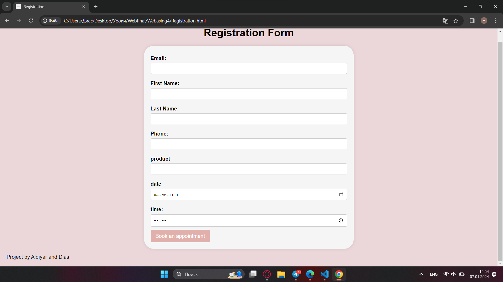

## Spa and Massage Services. 
"DryFresh"

DryFresh is a web application that provides detailed information about massage and spa services, available therapists, their schedules and the ability to make online bookings. Users can create personal accounts, track their bookings and participate in a rewards system. The project is aimed at clients looking for a convenient and effective way to receive massage and spa treatments.
### Team
Ibragimov Dias, Maratov Aldiyar, Diana Narynbekova

### Step-by-step instructions for launching the application:

- Install the necessary software: Node.js, MongoDB, npm, golang.
- Clone the SpaBook repository from GitHub.
- In a terminal, run npm install to install the dependencies.
- Set up a MongoDB database.
- Create a configuration file with database settings and other parameters.
- Start the server using the npm start command.
- Open a web browser and go to http://localhost:3000.

### Tools used, links to sources:

Tools: Node.js, Golang, Postman, MongoDB, HTML, CSS, JavaScript.
